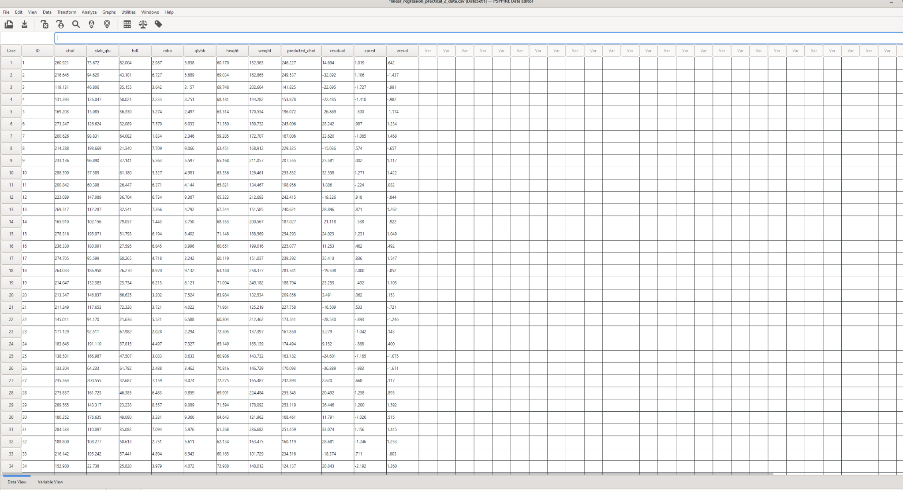
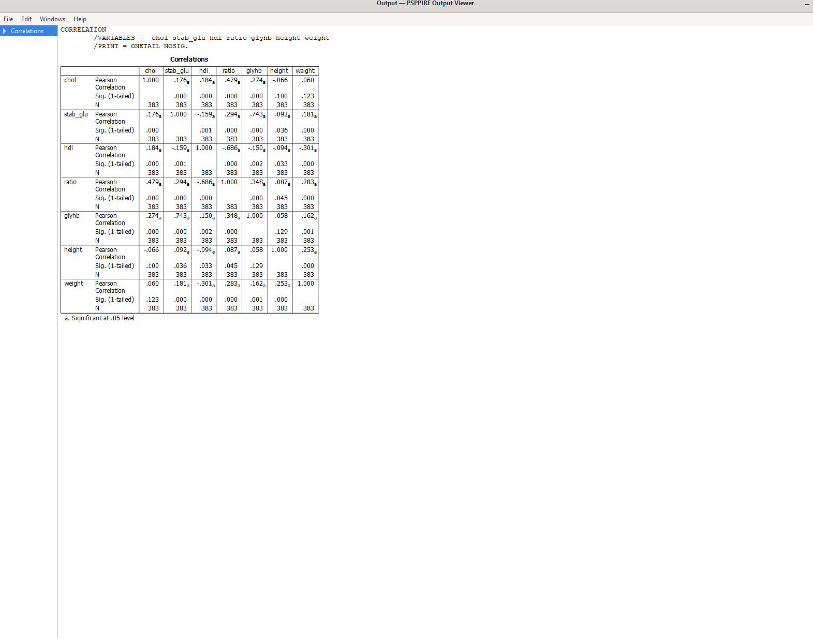
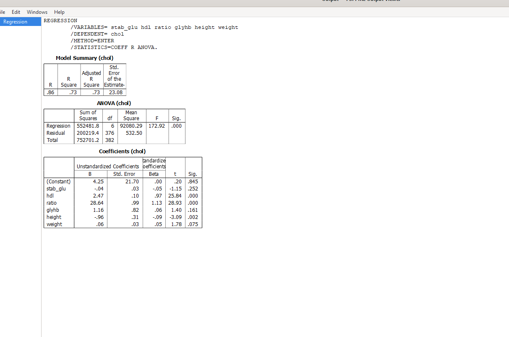
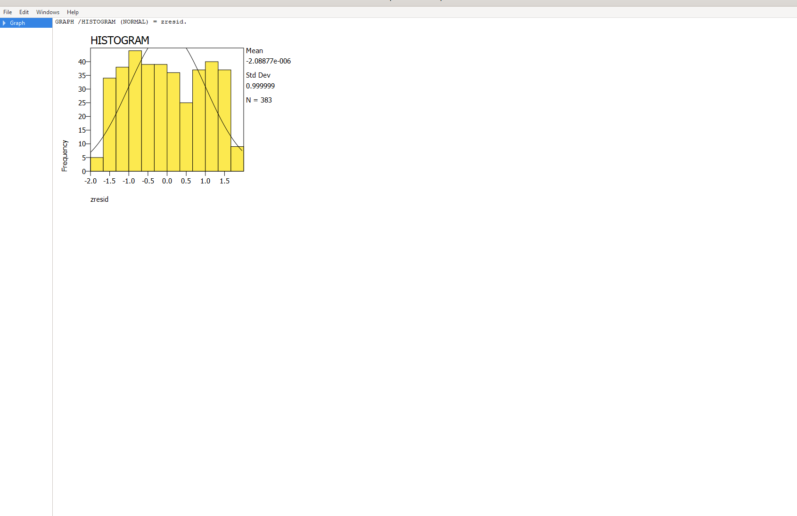

[README.md](https://github.com/user-attachments/files/27235101/README.md)
# Практичне заняття №12 — Лінійний регресійний аналіз

**Дисципліна:** Теорія ймовірностей та математична статистика  
**Тема:** Лінійний регресійний аналіз  
**Група:** АІК-43  
**Виконав:** Вівчар Вадим  

## Мета роботи

Навчитись будувати лінійну регресійну модель між залежною та незалежними змінними, визначати рівняння регресії та оцінювати якість побудованої моделі.

## Файли репозиторію

### Звіт

- [Готовий PDF-звіт](practical_work_12_linear_regression.pdf)

### Дані

- [Основні дані для аналізу](linear_regression_data.csv)
- [Дані без службових колонок](linear_regression_basic_data.csv)

### Команди PSPP

- [Файл із командами аналізу PSPP](analysis_commands.sps)

### Скріншоти виконання

- [Скріншот 1 — Вхідні дані](01_input_data.png)
- [Скріншот 2 — Кореляційна матриця](02_correlation_matrix.png)
- [Скріншот 3 — Результати лінійної регресії](03_regression_results.png)
- [Скріншот 4 — Гістограма стандартизованих залишків](04_residuals_histogram.png)

## Хід виконання роботи

1. Дані було імпортовано у PSPP з CSV-файлу.
2. Побудовано кореляційну матрицю для змінних `chol`, `stab_glu`, `hdl`, `ratio`, `glyhb`, `height`, `weight`.
3. Побудовано лінійну регресійну модель, де залежною змінною є `chol`, а незалежними змінними є `stab_glu`, `hdl`, `ratio`, `glyhb`, `height`, `weight`.
4. Оцінено якість моделі за коефіцієнтом детермінації `R²`.
5. Побудовано гістограму стандартизованих залишків для перевірки залишків моделі.

## Пруфи виконання

### 1. Вхідні дані



### 2. Кореляційна матриця



### 3. Результати лінійної регресії



### 4. Гістограма стандартизованих залишків



## Результати

За результатами побудови лінійної регресійної моделі отримано:

- залежна змінна: **chol**;
- незалежні змінні: **stab_glu, hdl, ratio, glyhb, height, weight**;
- коефіцієнт детермінації: **R² ≈ 0.734**;
- скоригований коефіцієнт детермінації: **Adjusted R² ≈ 0.730**.

Рівняння регресії:

```text
chol = -0.038·stab_glu + 2.473·hdl + 28.640·ratio + 1.156·glyhb - 0.962·height + 0.057·weight + 4.246
```

## Висновок

Побудована лінійна регресійна модель має достатньо високу якість, оскільки значення коефіцієнта детермінації становить приблизно **0.734**. Це означає, що модель пояснює близько **73.4%** варіації залежної змінної `chol`.

Найбільший вплив на значення `chol` у побудованій моделі мають змінні `ratio` та `hdl`, оскільки їх коефіцієнти мають найбільші значення за модулем.
